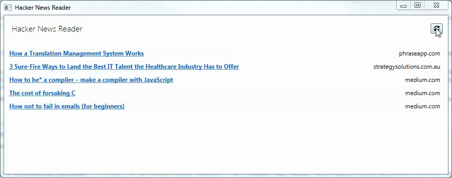

# Hacker News Reader#

> This program has been written to get an insight into the .NET world. By creating a Hacker News clone you can discover most of the language features and use them practically.

## Methods used

* WPF GUI
* C# Async/Await
* C# Lambdas
* JSON Parsing and FontAwesome as external Packages
* Task Lifecycle represented in the GUI: Loading, Failure, Completion (Through `NotifyTaskCompletion.cs`)
* List Item implemented as a `UserControl`

## License

[MIT](./license)
